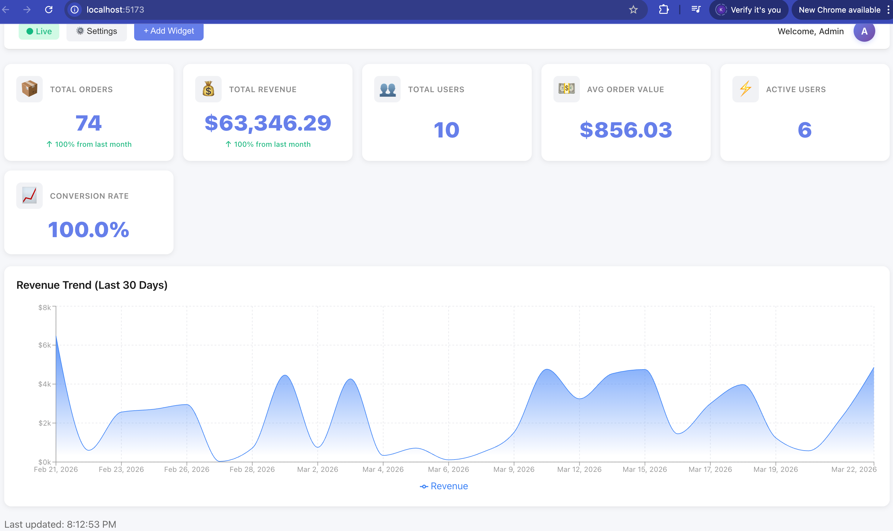

# FlexiBoard Pro

A production-ready real-time monitoring dashboard platform with flexible data source integration, drag-and-drop widget builder, and enterprise-grade clean architecture.

---

## Overview

FlexiBoard Pro enables organizations to aggregate, visualize, and act on data from multiple sources without custom coding. Connect any data source (REST APIs, CSV, webhooks), build real-time dashboards in minutes, and share insights across teams.

---

## Core Features

- **Real-time Dashboard** — Live updates via SignalR WebSocket (every 5 seconds)
- **Flexible Data Connectors** — REST APIs, CSV files, webhooks, extensible architecture
- **Drag & Drop Builder** — Customize dashboards with react-grid-layout, auto-persisted layouts
- **Multi-User Authentication** — JWT-based auth with role-based access (Admin/Editor/Viewer)
- **Responsive Design** — Mobile-friendly interface, works across all devices
- **Resilience Patterns** — Polly retry & circuit breaker for fault tolerance
- **Memory Caching** — 30-second cache to optimize performance
- **Docker Ready** — Production-grade containerization with docker-compose

---

## Quick Start

### Local Development (2 minutes)

**Terminal 1 — Backend:**

```bash
cd backend/FlexiBoard.API
dotnet run
```

API runs on `http://localhost:5000` | Swagger: `http://localhost:5000/swagger`

**Terminal 2 — Frontend:**

```bash
cd frontend
npm install
npm run dev
```

Dashboard runs on `http://localhost:5173`

### Docker Deployment (1 command)

```bash
docker-compose up --build
```

- Frontend: `http://localhost:3000`
- Backend: `http://localhost:5000`

---

## System Architecture

### Clean Architecture (4 Layers)

```
FlexiBoard.Domain/
  └── Entities: Product, Order, User, RevenueTrend, DashboardData

FlexiBoard.Application/
  ├── Interfaces: IDashboardService, IAuthenticationService, IDataSourceConnector
  └── Services: DashboardService, AuthenticationService

FlexiBoard.Infrastructure/
  ├── ExternalAPIs: FakeStoreApiClient (with Polly patterns)
  ├── DataConnectors: RestApiConnector, CsvConnector, WebhookConnector
  └── DataGenerators: OrderGenerator

FlexiBoard.API/
  ├── Controllers: DashboardController, DataSourcesController, AuthController
  ├── Hubs: DashboardHub (SignalR)
  └── BackgroundServices: DashboardRefreshService
```

### Frontend Architecture (React + Vite)

```
src/
  ├── components/        Dashboard.jsx, DataSources.jsx, Login.jsx
  ├── widgets/          MetricCard.jsx, RevenueChart.jsx
  ├── hooks/            useRealtime.js, useGridLayout.js, useAuth.js
  ├── utils/            api.js, formatters.js
  └── App.jsx           Root component
```

---

## Tech Stack

| Layer | Technology |
|-------|-----------|
| **Backend** | .NET 8, ASP.NET Core, SignalR, Polly |
| **Frontend** | React 18, Vite, Axios, Recharts, react-grid-layout |
| **DevOps** | Docker, Docker Compose |

---

## API Reference

### Dashboard Endpoints

```bash
GET /api/dashboard
  Response: { totalOrders, totalRevenue, totalUsers, revenueTrends, lastUpdated }

POST /api/datasources
  Register new data source

GET /api/datasources
  List all data sources

POST /api/datasources/test
  Test connection before saving

POST /api/auth/login
  Authenticate user (returns JWT token)
```

### Real-time WebSocket

```bash
WebSocket: ws://localhost:5000/hub/dashboard
  Event: ReceiveDashboardUpdate
  Frequency: Every 5 seconds
```

### Demo Credentials

```
Username: demo
Password: demo123

Admin User: admin / admin123
```

---

## Data Flow Architecture

```
Backend Background Service (5-second interval)
  ↓ Fetch from Data Sources (with Polly resilience)
  ↓ Generate synthetic orders if needed
  ↓ Calculate metrics & trends
  ↓ Update MemoryCache (30-second TTL)
  ↓ SignalR broadcasts to connected clients
  ↓
Frontend receives ReceiveDashboardUpdate
  ↓ React state updates
  ↓ Component re-renders
  ↓ User sees live data
```

---

## Key Features Breakdown

### 1. Real-time Monitoring

- SignalR hub maintains persistent WebSocket connections
- Background service polls data sources every 5 seconds
- Memory cache prevents redundant API calls
- All connected clients receive simultaneous updates

### 2. Flexible Data Connectors

- **REST API** — HTTP(S) with authentication support
- **CSV Files** — Local or remote CSV sources
- **Webhooks** — Push-based data ingestion
- **Extensible** — Easy to add Database, GraphQL, or custom connectors

### 3. Authentication & Authorization

- JWT token-based authentication (1-hour access, 7-day refresh)
- Role-based access control (Admin/Editor/Viewer)
- User registration and profile management
- Audit logging foundation
- Refresh token rotation

### 4. Dashboard Customization

- Drag-and-drop widget positioning
- Grid layout persistence (localStorage)
- Responsive widget sizing
- Real-time data binding

### 5. Resilience & Performance

- **Polly Policies**: Retry with exponential backoff, circuit breaker
- **Caching**: 30-second MemoryCache for dashboard metrics
- **Error Handling**: Comprehensive logging and fallback strategies
- **Connection Management**: Auto-reconnect on SignalR disconnect

---
### Architectural Patterns

- **Clean Architecture**: Layered separation with inward dependency flow
- **Dependency Injection**: Built-in IoC container in ASP.NET Core
- **Repository Pattern**: Data access abstraction (via connectors)
- **Observer Pattern**: SignalR hub-based real-time updates
- **Circuit Breaker**: Polly policies for resilient API calls

---

## Performance Optimizations

1. **MemoryCache** (30s TTL) — Stores aggregated dashboard metrics
2. **Background Polling** (5s interval) — Prevents data staleness
3. **SignalR Binary Protocol** — Efficient real-time communication
4. **React Optimization** — Grid layout prevents unnecessary re-renders
5. **LocalStorage Persistence** — Layout saved without server calls
6. **Polly Circuit Breaker** — Stops cascading failures from external APIs

---

## Security Considerations

1. **CORS Policy** — Frontend origin whitelist in Program.cs
2. **HTTPS Redirect** — Enforced in production
3. **JWT Validation** — Token expiration and refresh mechanisms
4. **Input Validation** — Data validation in all API controllers
5. **SignalR Authentication** — Can be extended with bearer tokens
6. **Rate Limiting** — Polly policies for throttling

---
## Business Model

**Value Proposition:** "Connect any data source. Visualize in real-time. Share instantly. Scale infinitely."

**Pricing:** SaaS ($99-Custom/month) + On-premises licensing + Professional services

**Target Market:** Mid-market companies, DevOps teams, Business analysts

**Competitive Advantage:** Flexibility + Simplicity + Cost-effective pricing

---

## UI/UX Website


---

## 💡 Future Enhancements

- [ ] Database integration (SQL Server)
- [ ] Authentication & Authorization (OAuth2/OIDC)
- [ ] WebSocket auto-reconnection improvements
- [ ] More widget types (pie charts, tables, gauges)
- [ ] Dashboard templates library
- [ ] Role-based access control
- [ ] Alert & notification system
- [ ] Metrics export (PDF, CSV)
- [ ] Dark mode support
- [ ] Mobile app (React Native)
